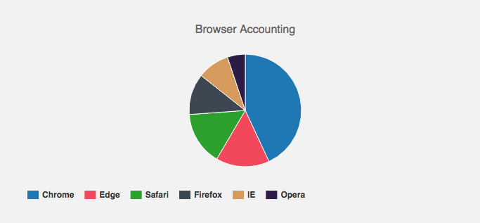
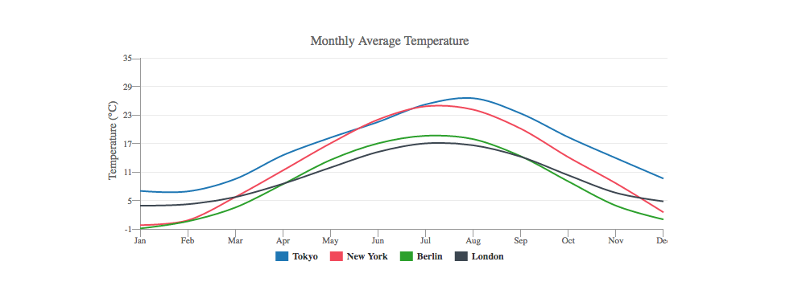
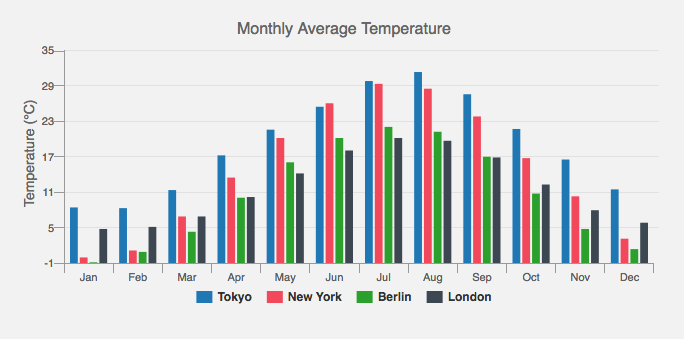

# dCharts

A powerful charting and visualization library is based on d3.


## Installation

```bash
$ npm i dcharts
```

## Examples

Circle :)


Pie :)



Line :)



Bar :)




## Developing

Build:

```
$ cd examples
$ npm i
$ npm run build
```

Start dev server:

```
$ npm start
```

## API

### dcharts

* [dCharts.defaults](https://github.com/vicanso/dcharts/blob/master/md/defaults.md) 用于设置各图表的默认属性

* [dCharts.Chart](https://github.com/vicanso/dcharts/blob/master/md/chart.md) 各图表构造函数的基类

* [dCharts.Circle](https://github.com/vicanso/dcharts/blob/master/md/circle.md) 图表Circle

* [dCharts.Line](https://github.com/vicanso/dcharts/blob/master/md/line.md) 图表Line

* [dCharts.Pie](https://github.com/vicanso/dcharts/blob/master/md/pie.md) 图表Pie

* [dCharts.Bar](https://github.com/vicanso/dcharts/blob/master/md/bar.md) 图表Bar

* [dCharts.Heatmap](https://github.com/vicanso/dcharts/blob/master/md/heatmap.md) 图表Bar

* [dCharts.d3](https://github.com/d3/d3) d3

## License

MIT
